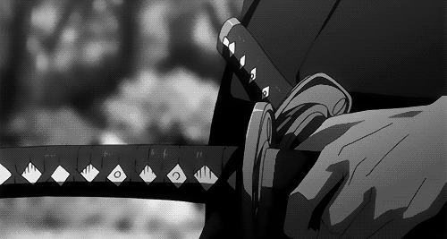

# 👋 Hey there, I'm Itired! 

    

## 🌟 About Me
> *"The code is not about perfection, it's about the journey!"*  

I'm a Frontend Developer just starting my adventure in this vast world of web development. Passionate about creating beautiful and interactive interfaces with a touch of magic! ✨ I'm also developing Telegram bots to enhance user experience and automate tasks.

## 🛠️ Tech Stack

## 📊 GitHub Stats

## 🔥 Current Focus
- 🌐 Mastering frontend basics
- 🎨 Creating beautiful (over-animated?) designs
- ⚡ Learning JavaScript frameworks

## 🎮 Fun Facts
- 🎵 Code for calm bits
- 🎮 playing games(rl,dota2,cs2,asseto corsa)

  

## 📫 Let's Connect!

 <a href="https://discord.com/users/itiredof" target="_blank" rel="noreferrer"> <picture> <source media="(prefers-color-scheme: dark)" srcset="https://raw.githubusercontent.com/danielcranney/readme-generator/main/public/icons/socials/discord-dark.svg" /> <source media="(prefers-color-scheme: light)" srcset="https://raw.githubusercontent.com/danielcranney/readme-generator/main/public/icons/socials/discord.svg" />  </picture> </a> <a href="https://www.github.com/itired1" target="_blank" rel="noreferrer"> <picture> <source media="(prefers-color-scheme: dark)" srcset="https://raw.githubusercontent.com/danielcranney/readme-generator/main/public/icons/socials/github-dark.svg" /> <source media="(prefers-color-scheme: light)" srcset="https://raw.githubusercontent.com/danielcranney/readme-generator/main/public/icons/socials/github.svg" />  </picture> </a>

    

